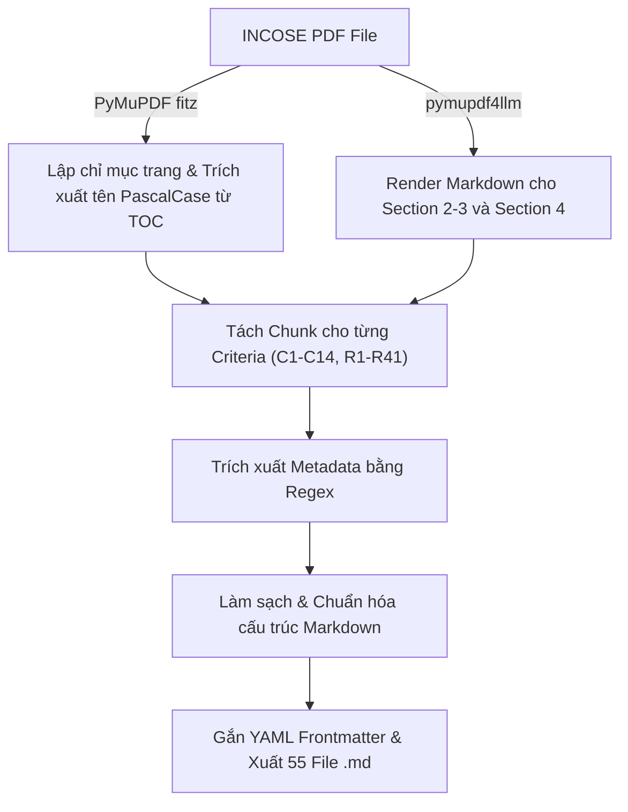

# Hướng Dẫn Kỹ Thuật: Parse INCOSE Guide To Writing Requirements Sang Markdown

Tài liệu này đặc tả quy trình, thuật toán và các kỹ thuật tiền xử lý/hậu xử lý chi tiết nhằm chuyển đổi tài liệu **INCOSE Guide to Writing Requirements (v3.1)** từ định dạng PDF sang **55 file Markdown chuẩn hóa** (14 Characteristics và 41 Rules), phục vụ làm cơ sở dữ liệu tri thức chất lượng cao cho Agent thẩm định yêu cầu kỹ thuật (Requirements Inspection Agent).

---

## 1. Tổng Quan & Cấu Trúc Nguồn

### 1.1. Thống kê tiêu chí trong INCOSE v3.1
Trong bản INCOSE Guide v3.1 (tổng 115 trang), toàn bộ các tiêu chí nằm từ **trang 26 đến trang 101**:
* **14 Characteristics:**
  * **C1 - C9** (Trang 26 - 44): Thuộc *Section 2 - Characteristics of Need and Requirement Statements* (áp dụng cho từng câu đơn lẻ: `individual_statement`).
  * **C10 - C14** (Trang 45 - 56): Thuộc *Section 3 - Characteristics of Sets of Needs and Requirements* (áp dụng cho tập hợp yêu cầu: `set_of_statements`).
* **41 Rules:**
  * **R1 - R41** (Trang 57 - 101): Thuộc *Section 4 - Rules for Need and Requirement Statements and Sets of Needs and Requirements*.
  * Hầu hết quy tắc (R1 - R39) áp dụng cho `individual_statement`, riêng R40 - R41 áp dụng cho `set_of_statements`.

### 1.2. Cấu trúc thư mục đầu ra
Các file sau khi xử lý được lưu vào thư mục [data/processed/](file:///d:/IncoseAndAspiceInspectAgent/data/processed/):

```text
data/processed/
├── characteristics/
│   ├── C01_Necessary.md
│   ├── C02_Appropriate.md
│   ├── ...
│   └── C14_AbleToBeValidated.md
└── rules/
    ├── R01_SentenceStructure.md
    ├── R02_UseActiveVoice.md
    ├── ...
    └── R41_Structured.md
```

---

## 2. Đặc Tả Metadata (YAML Frontmatter)

Mỗi file Markdown bắt đầu bằng phần YAML Frontmatter với các trường đã thống nhất:

### 2.1. Metadata cho Rule (41 file)
```yaml
---
id: R1
name: SentenceStructure               # Tên PascalCase chuẩn lấy từ Mục lục tài liệu (TOC)
type: rule
page: 57                              # Số trang in thực tế trong tài liệu PDF
target_scope: individual_statement   # "individual_statement" hoặc "set_of_statements"
established_characteristics:
  - C3
  - C4
  - C7
  - C8
  - C9
related_rules:
  - R2
  - R3
  - R11
  - R18
  - R27
---
```

### 2.2. Metadata cho Characteristic (14 file)
```yaml
---
id: C1
name: Necessary
type: characteristic
target_scope: individual_statement   # C1-C9: "individual_statement", C10-C14: "set_of_statements"
supporting_rules:
  - R20
  - R30
page: 26                              # Số trang in thực tế trong tài liệu PDF
---
```

---

## 3. Quy Trình Kỹ Thuật (Pipeline Implementation)



### Bước 1: Quét trang & Trích xuất tên chuẩn từ Mục lục (TOC)
1. **Lấy tên PascalCase chính thức:** Quét trang 4 và 5 của PDF để xây dựng từ điển ánh xạ mã Rule sang tên PascalCase chuẩn (ví dụ: `R1` ➔ `SentenceStructure`, `R2` ➔ `UseActiveVoice`, `R7` ➔ `AvoidVagueTerms`), tránh việc bị in hoa toàn bộ như trong thân trang (`/ACCURACY/SENTENCESTRUCTURE`).
2. **Page Mapping:** Dùng `pymupdf` (`fitz`) định vị số trang xuất hiện của từng tiêu chí trong dải trang 26 đến 101.

### Bước 2: Chuyển đổi Markdown theo phạm vi mục
Để tối ưu tốc độ (~20 giây) và loại bỏ tạp âm từ phần Giới thiệu và Phụ lục:
- Render **Section 2 & 3 (Characteristics)**: Trang 26 đến 56.
- Render **Section 4 (Rules)**: Trang 57 đến 101.

### Bước 3: Trích xuất các trường Metadata (Metadata Extraction)
Từ khối text của từng tiêu chí, áp dụng Regex để bóc tách tự động:
1. **Target Scope:**
   * Characteristic: `C1` - `C9` ➔ `individual_statement`; `C10` - `C14` ➔ `set_of_statements`.
   * Rule: `R1` - `R39` ➔ `individual_statement`; `R40` - `R41` ➔ `set_of_statements`.
2. **Established Characteristics (cho Rule):**
   * Quét khối văn bản sau cụm `Characteristics that are established by this rule`:
   * Regex: `re.findall(r'\bC\d+\b', text_block)`
3. **Related Rules (cho Rule):**
   * Quét các câu dạng `\b(?:See also|Refer to)\s+([^\n]+)` với boundary `\b` (tránh bắt nhầm các từ như `prefer to`):
   * Regex: `re.findall(r'\bR\d+\b', line)`
4. **Supporting Rules (cho Characteristic):**
   * Quét khối văn bản sau cụm `Rules that help establish this characteristic`:
   * Regex: `re.findall(r'\bR\d+\b', text_block)`

### Bước 4: Làm sạch & Chuẩn hóa nội dung (Content Cleaning & Normalization)
Văn bản xuất từ PDF trải qua chuỗi tiền xử lý và làm sạch nghiêm ngặt:

1. **Xóa Running Header/Footer & Số trang rác:**
   * Xóa dòng lặp tiêu đề: `_Guide to Writing Requirements_`
   * Xóa mã tài liệu bản quyền: `INCOSE-TP-2010-006-04| VERS/REV: 3.1  |  May 2022`
   * Xóa các số trang rác đứng đơn độc giữa các trang (`\n\s*\d{1,3}\s*\n`).
2. **Xóa các thẻ HTML rác `<mark>`:**
   * Xóa sạch các thẻ `<mark>`, `</mark>` do `pymupdf4llm` tự động sinh ra.
3. **Chuẩn hóa các đề mục cấp 3 (`###`):**
   * Chuẩn hóa các đề mục chính: `Definition`, `Rationale`, `Guidance`, `Elaboration`, `Examples`, `Exceptions and relationships`, `Rules that help establish this characteristic`, `Characteristics that are established by this rule`, `Attributes that help establish this characteristic`, `Activities and concepts associated with this characteristic`.
   * Hỗ trợ tự động nhận diện và ngắt dòng khi tiêu đề có nội dung nằm cùng dòng.
4. **Làm sạch thẻ gạch chân `<u>` và định dạng mục Examples:**
   * Xóa bỏ các ký tự dấu hai chấm gạch chân lạ như `_<u>:</u>_` hoặc `<u>:</u>` thành `:`.
   * Chuyển các đề mục nhóm ví dụ con (như `<u>Subject examples</u> :`, `<u>Verb examples</u> :`) thành **Header cấp 4 (`#### Subject examples`, `#### Verb examples`)**.
   * Chuẩn hóa nhãn đúng/sai thành định dạng in đậm: `**Unacceptable system requirement:** ...`, `**Acceptable:** ...`, `**Poor:** ...`, `**Better:** ...`, `**Good:** ...`.
   * Cắt bỏ các ký tự mở ngoặc vuông `[` bị nhốt nhầm vào cuối thẻ `<u>`.
   * Xóa sạch 100% các thẻ `<u>` và `</u>` còn sót lại.
5. **In đậm câu quy tắc cốt lõi (Core Rule Statement):**
   * Bóc tách và in đậm câu tóm tắt quy tắc ngay sau tiêu đề Rule và trước `### Elaboration`:
     ```markdown
     ## **4.1.1 R1 - /ACCURACY/SENTENCESTRUCTURE**

     **Use a structured, complete sentence.**

     ### Elaboration
     ```
6. **Chuyển đổi danh sách tiêu chí liên kết thành gạch đầu dòng (Bullet Points):**
   * Chuyển các danh sách mã tiêu chí bị dính liền trên 1 dòng thành danh sách có cấu trúc:
     ```markdown
     ### Characteristics that are established by this rule

     - C3 - Unambiguous
     - C5 - Singular
     ```
     và
     ```markdown
     ### Rules that help establish this characteristic

     - R20 - /Singularity/AvoidPurpose
     - R30 - /Uniqueness/ExpressOnce
     ```
7. **Loại bỏ các tiêu đề nhóm (Category Headings) bị rò rỉ:**
   * Cắt bỏ các tiêu đề nhóm chủ đề (ví dụ `## **4.3 Non-ambiguity**`) bị dính vào chân file của rule đứng liền trước (R09, R11, R17, R23, R25, R26, R28, R30, R31, R32, R33, R35, R39).

### Bước 5: Ghi file ra đĩa
1. Ghép Frontmatter với nội dung Markdown đã làm sạch.
2. Ghi ra thư mục tương ứng `data/processed/characteristics/` hoặc `data/processed/rules/`.

---

## 4. Kiểm Thử & Đảm Bảo Toàn Vẹn (Verification)

Hệ thống được phát triển theo quy trình **Test-Driven Development (TDD)** với bộ test tại [tests/test_pdf_converter.py](file:///d:/IncoseAndAspiceInspectAgent/tests/test_pdf_converter.py) (8/8 bài test đạt 100% Passed):

1. **`test_clean_text`**: Kiểm tra xóa header/footer, thẻ mark, in đậm rule statement, chuẩn hóa H3 `Exceptions and relationships`.
2. **`test_clean_examples_and_u_tags`**: Kiểm tra xóa sạch `<u>`, chuẩn hóa đề mục con `####`, in đậm nhãn `**Acceptable:**`/`**Unacceptable:**`.
3. **`test_clean_inline_headers_and_leaked_category`**: Kiểm tra ngắt dòng tiêu đề nội tuyến, định dạng bullet points và xóa category header rò rỉ.
4. **`test_extract_rule_metadata`**: Kiểm tra trích xuất metadata của Rule (id, name, target_scope, established_characteristics, related_rules).
5. **`test_extract_characteristic_metadata`**: Kiểm tra trích xuất metadata của Characteristic (id, name, target_scope, supporting_rules).
6. **`test_target_scope_distinction`**: Kiểm tra phân loại chính xác phạm vi `individual_statement` vs `set_of_statements`.
7. **`test_generate_frontmatter`**: Kiểm tra tính hợp lệ của cú pháp YAML Frontmatter.
8. **`test_integration_generated_dataset`**: Kiểm tra toàn diện trên toàn bộ 55 file đã xuất ra đĩa (đủ 14 C + 41 R, 100% file có metadata hợp lệ, thân bài đầy đủ các đề mục).

---

## 5. Hướng Dẫn Thực Thi

Bạn có thể chạy công cụ chuyển đổi thông qua script tiện ích [scripts/run_parser.py](file:///d:/IncoseAndAspiceInspectAgent/scripts/run_parser.py):

```powershell
# Chạy với tham số mặc định
python scripts/run_parser.py

# Hoặc tùy chỉnh đường dẫn nguồn và đích
python scripts/run_parser.py --pdf "data/raw/INCOSE_RWG_Guide_to_Writing_Requirements_V3.1_041822.pdf" --output "data/processed"
```
